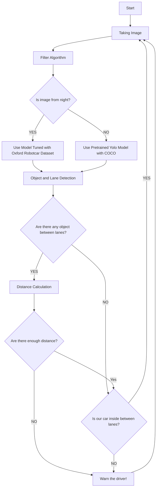

# Deep Learning based Driver Assistance System (DL-DAS)

## Paper Abstract:

Nowadays, vehicles have become an integral part of our lives due to mobility advantages. However, traffic accidents continue to occur worldwide. This study aims to develop a pure image-based solution using a combination of "deep learning" and "image processing" techniques to minimize the occurrence of traffic accidents. While the You Only Look Once (YOLO) algorithm is one of the fastest object detection algorithms, it faces slight accuracy and robustness problems. Afterward, the YOLO algorithm with Darknet-53 architecture, which is pre-trained with COCO Dataset, has faced reliability issues to detect objects in "Night" images while getting high results on "Day" images. Therefore, we suspect that the COCO Dataset is inclined toward brighter images rather than low-light ones. To support this idea with scientific evidence, we analyzed the COCO Dataset. Besides, to overcome this issue, finetuning and classifier filter design have been proposed. Additionally, lane detection systems were developed to improve the reliability of the feedback system. As a result, the classifier filter system achieved 99.92% accuracy in distinguishing between "Night" and "Day" images. After evaluation processes, the proposed system achieved ~0.92 IOU with YOLOV3 fine-tuned model and ~0.95 IOU with YOLOV4 fine-tuned model. Furthermore, the lane detection algorithm achieved 88.00% accuracy.

## Algorithm Procedure:

|Filter creation algorithm|
|------|

 

|Filter algorithm|
|-------|

|Flowchart|
|----|

## Results:
###### Day and night image matrice values:

|Before filter|After filter|
|---------|---------------|

||

